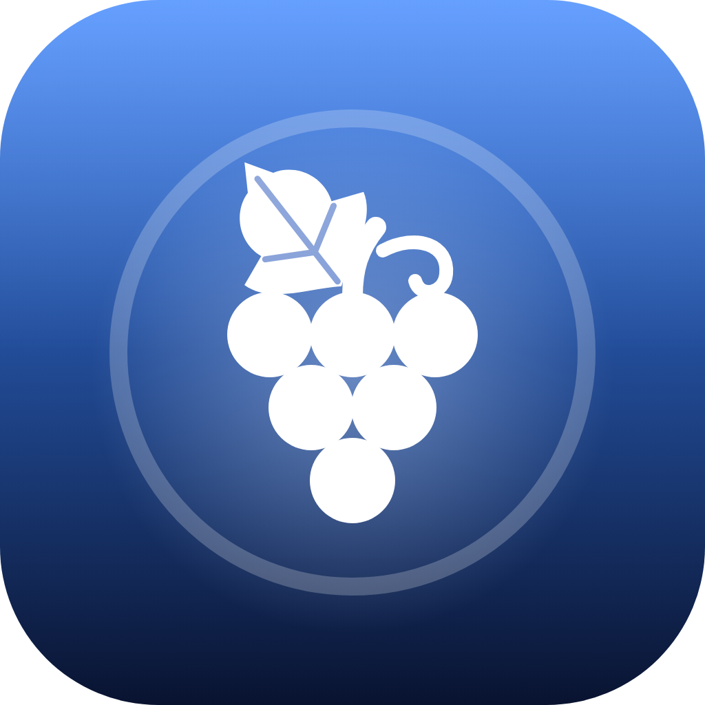

# Dionysos

An on-device iOS signer for **your own Apple IDs**. Import an IPA, pick which of your accounts signs it, and Dionysos signs and installs it straight onto your iPhone. No computer needed.

## Features

- **Several Apple IDs, one tap to switch.** Save your main account and any spare accounts you created yourself, set a default, and choose the account per app. Refreshes reuse the account that signed the app.
- **Account management.** For each Apple ID: its team, development certificates (revoke), App IDs (delete, with the weekly limit shown), registered devices, and the apps it signed on this iPhone.
- **IPA library.** Imported IPAs stay in the app so you can sign them again with any of your accounts.
- **On-device install.** Uses this iPhone's pairing file and LocalDevVPN, the way a computer would.
- **Expiry reminders.** A notification the day before a free-account app expires.
- **Anisette servers.** A built-in list, refreshed from SideStore's community list, plus custom servers.
- **Dark navy, Liquid Glass UI** with blue accents (iOS 26+).

## ⚠️ Only use your own Apple IDs

Sign in only with Apple IDs that belong to you. Never use someone else's account, a shared or bought account, or one you don't have permission to use. Dionysos asks you to confirm this before the first sign-in.

## Building

CI (`.github/workflows/build.yml`) builds an unsigned IPA on every push:

1. `bash ./build-rust.sh` builds the Rust core (`rust/`) into `DionysosFFI.xcframework`.
2. `xcodegen generate` creates `Dionysos.xcodeproj` from `project.yml`.
3. `xcodebuild` builds the app; the workflow ad-hoc signs and zips it.

## Acknowledgments

Built on [AltLoad](https://github.com/mirazbakis/AltLoad), [isideload](https://github.com/nab138/isideload), [idevice](https://github.com/jkcoxson/idevice), [StikPair](https://github.com/StephenDev0/StikPair) and [LocalDevVPN](https://github.com/jkcoxson/LocalDevVPN), with anisette servers from [SideStore](https://github.com/SideStore). Inspired by AltStore, Feather and Ksign. See the in-app Acknowledgments page and [THIRD_PARTY_NOTICES.md](THIRD_PARTY_NOTICES.md).

Dionysos isn't affiliated with Apple or any of the projects above.
